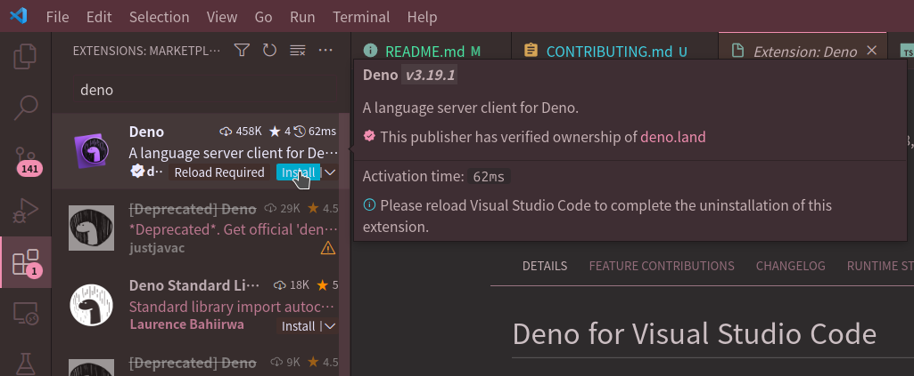

# Contributing

Thank you for your interest in contributing to this project!

## Getting help

do not hesitate to ask for help if you're stuck. you can ask for help in the following places:

- [github discussions][discussions]
- [official BN discord server][server]

[discussions]: https://github.com/scarf005/nightscape/discussions/categories/q-a
[server]: https://discord.gg/XW7XhXuZ89

## Setting up

### Deno

to run typescript code, you need to install [deno][deno]. to get familiar with deno, please read
[Getting Started][getting-started] on deno's website (~20 min).

[getting-started]: https://deno.com/manual@v1.34.0/getting_started
[deno]: https://deno.com/manual@v1.34.0/getting_started/installation

### Editor

[vscode][vscode] is recommended for best developing experience.

- install [vscode][vscode].

- install [deno extension][deno-vscode].
  - open vscode.
  - press `Ctrl+Shift+X` to open extension manager.
  - search `deno` and install the extension.

[vscode]: https://code.visualstudio.com/Download
[deno-vscode]: https://marketplace.visualstudio.com/items?itemName=denoland.vscode-deno

## Writing Schemas

TODO

## Running and writing tests

TODO
